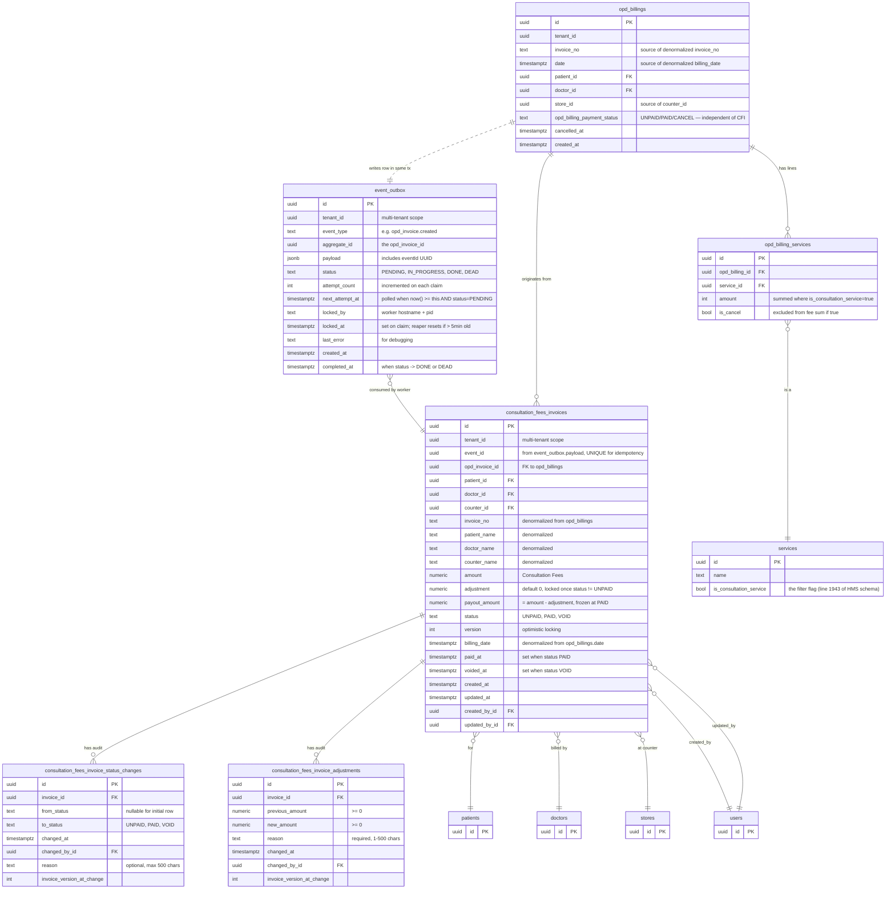

# Data Model — ER Diagram

The new tables in the HMS PostgreSQL database. Existing HMS tables are shown for reference (in lighter style) to illustrate the joins.

## Key design points

1. **`event_outbox` is the trigger.** The HMS writes a row to `event_outbox` in the **same transaction** as the OPD billing insert. The Summary Service worker polls `event_outbox` with `FOR UPDATE SKIP LOCKED` and creates the CFI (ADR 0001). The outbox is a queue, not a stream: rows are claimed, processed, and transitioned to `DONE` or `DEAD`. Every job is a row — easy to search, easy to debug.

2. **Idempotency via `event_id`.** The CFI row has `event_id UUID UNIQUE NOT NULL`. The worker uses `INSERT ... ON CONFLICT (event_id) DO NOTHING`. A duplicate event (from the reaper resetting a stuck claim) is a no-op.

3. **Business invariant via `(tenant_id, opd_invoice_id)`.** Even if the `event_id` changes (it won't, in this design — the outbox preserves it), the business key prevents two CFIs for the same OPD invoice. This is enforced at the DB level (ADR 0004).

4. **Denormalized display fields.** `invoice_no`, `patient_name`, `doctor_name`, `counter_name`, `billing_date` are denormalized onto the CFI row. The summary list page reads them directly without joins. Drift risk is low (assumption in brief Section 8.2 #1).

5. **Status is a TEXT enum with CHECK.** Simple, no separate enum type. Three values: `UNPAID`, `PAID`, `VOID`. Transitions enforced at the app layer (ADR 0005).

6. **Optimistic locking via `version`.** Every UPDATE bumps the version. The API uses `If-Match` (ADR 0006).

7. **Amounts are `NUMERIC(12, 2)`.** Standard precision for currency. The `payout_amount` has a CHECK constraint enforcing the formula `payout = amount - adjustment` (ADR 0014).

8. **Audit tables are append-only.** `consultation_fees_invoice_status_changes` and `consultation_fees_invoice_adjustments` are never UPDATEd. The current state is on the CFI row; the history is in the audit table. The `invoice_version_at_change` column cross-references the version on the CFI at the time of the change.

9. **FK to `opd_billings` is `(opd_invoice_id) REFERENCES opd_billings(id)`.** Non-composite: the HMS is single-tenant in practice, so `opd_billings.id` is globally unique and the simple FK is enough. (Earlier drafts of the brief described a composite `(tenant_id, opd_invoice_id) → (tenant_id, id)` FK, but `opd_billings` has no `tenant_id` column on the on-prem HMS, so the DDL in `schema.sql:130-131` uses the simple form.)

10. **Search uses `pg_trgm` substring match on `lower(invoice_no)`.** One GIN index with the `gin_trgm_ops` operator class. Doctor name is intentionally NOT substring-searchable (doctor lookup goes through the `doctorId` filter); patient name is intentionally NOT searchable (handled by the HMS's existing patient search). See ADR 0010.

11. **Outbox lifecycle.** Rows flow `PENDING → IN_PROGRESS → DONE` (success) or `PENDING → IN_PROGRESS → DEAD` (5 attempts, non-retryable error). The stale-claim reaper resets `IN_PROGRESS` rows whose `locked_at` is > 5 minutes old back to `PENDING`. The daily pruner deletes `DONE` rows older than 7 days.
