# C4 — Component View (inside the Summary Service)

The two Summary Service processes (API and worker) are two systemd units
running the same compiled binary with different `--mode` flags. The
component view below shows the modules within the single Express codebase
(per ADR 0002).

```mermaid
C4Component
    title Component View: Summary Service (single codebase, two systemd units)

    Container_Boundary(c1, "Summary Service codebase") {
        Component(http_server, "HTTP Server", "Express bootstrap", "src/http/server.ts. Mounted under --mode=api. Wires helmet, cors, rawBody capture, HMAC, tenant guard, error handler, routes.")
        Component(inbox_worker, "Inbox Worker", "Outbox poller loop", "src/workers/. Polls event_outbox with FOR UPDATE SKIP LOCKED; creates CFIs; updates Redis. Mounted under --mode=worker.")
        Component(hmac_auth, "HMAC Auth Middleware", "Express middleware", "src/http/middleware/hmac-auth.ts. Validates X-Signature, X-Timestamp, X-Service-Id, X-Tenant-Id; ±5 min skew; 10k-LRU replay cache.")
        Component(tenant_guard, "Tenant Guard", "Express middleware", "src/http/middleware/tenant-guard.ts. Reads verified tenantId from req, attaches req.prisma = tenant-scoped Prisma client.")
        Component(tenant_scope, "Tenant-scope Prisma Extension", "Prisma extension", "src/db/tenant-scope.ts. Forces where: { tenantId } on every query on the CFI model.")

        Component(cfi_routes, "CFI Routes", "Express handlers", "src/http/routes/cfi.routes.ts. All 5 business routes in one file: list, aggregates, detail, PATCH /:id/status, POST /:id/adjustment.")
        Component(health_routes, "Health Route", "Express handlers", "src/http/routes/health.routes.ts. GET /healthz (public, no auth).")

        Component(cfi_service, "CFI Service", "Domain logic", "src/services/cfi-service.ts. createFromOpdInvoice, changeStatus (optimistic lock), addAdjustment.")
        Component(cfi_payout, "CFI Payout Formula", "Pure function", "src/services/cfi-payout.ts. payout = amount - adjustment.")

        Component(outbox_poller, "Outbox Poller", "Postgres poll loop", "src/workers/outbox-poller.ts. FOR UPDATE SKIP LOCKED claim; call CFI service; mark DONE / DEAD.")
        Component(stale_claim_reaper, "Stale-claim Reaper", "Periodic", "src/workers/stale-claim-reaper.ts. Resets IN_PROGRESS rows whose locked_at is >5 min old.")
        Component(outbox_pruner, "Outbox Pruner", "Periodic", "src/workers/outbox-pruner.ts. Deletes DONE/DEAD rows past their retention window.")

        Component(outbox_repo, "Outbox Repository", "Prisma + raw SQL", "src/db/outbox.ts. claimBatch, markDone, handleFailure, reapStaleClaims, pruneOldRows. Raw SQL for the SKIP LOCKED claim.")
        Component(prisma_client, "Prisma Client", "Singleton", "src/db/prisma.ts. Single PrismaClient per process.")
        Component(redis_counters, "Redis Counters", "ioredis pipelines", "src/lib/redis-counters.ts. HINCRBY / HINCRBYFLOAT for the daily aggregate buckets. No Lua.")
        Component(redis_client, "Redis Client", "ioredis singleton", "src/lib/redis.ts. Lazy-init, graceful on transient errors.")
        Component(pino_logger, "Pino Logger", "Logger", "src/lib/logger.ts. Structured JSON logs to stdout; /var/log/ycare-summary/*.log in prod via logrotate.")
        Component(errors, "AppError Hierarchy", "Domain errors", "src/lib/errors.ts. AppError, NotFoundError, ConflictError, ValidationError.")
        Component(validators, "Zod Validators", "Zod schemas", "src/lib/validators/cfi.ts. Query / body schemas for all routes.")
    }

    ContainerDb_Ext(postgres, "PostgreSQL", "")
    ContainerDb_Ext(redis, "Redis", "")

    Rel(http_server, hmac_auth, "Wraps every /consultation-fees-invoices/* request")
    Rel(http_server, tenant_guard, "After HMAC; attaches tenant-scoped Prisma to req")
    Rel(http_server, cfi_routes, "Mounts")
    Rel(http_server, health_routes, "Mounts (no auth)")

    Rel(cfi_routes, cfi_service, "changeStatus, addAdjustment (state machine + audit + Redis)")
    Rel(cfi_routes, tenant_scope, "Indirectly, via req.prisma")
    Rel(cfi_routes, validators, "Zod-parses query / body")

    Rel(cfi_service, prisma_client, "R/W CFI + audit tables")
    Rel(cfi_service, cfi_payout, "computePayoutAmount")
    Rel(cfi_service, redis_counters, "HINCRBY delta")
    Rel(cfi_service, errors, "throws NotFoundError, ConflictError")

    Rel(health_routes, prisma_client, "SELECT 1")
    Rel(health_routes, redis_client, "PING")

    Rel(inbox_worker, outbox_poller, "Owns the loop")
    Rel(inbox_worker, stale_claim_reaper, "Runs every 5 min")
    Rel(inbox_worker, outbox_pruner, "Runs daily")
    Rel(outbox_poller, outbox_repo, "claimBatch / markDone / handleFailure")
    Rel(outbox_poller, cfi_service, "createFromOpdInvoice")
    Rel(stale_claim_reaper, outbox_repo, "reapStaleClaims")
    Rel(outbox_pruner, outbox_repo, "pruneOldRows")
    Rel(outbox_repo, prisma_client, "via base client")

    Rel(prisma_client, postgres, "")
    Rel(redis_client, redis, "")
    Rel(redis_counters, redis_client, "uses")

    Rel(http_server, pino_logger, "Every request (pino-http)")
    Rel(inbox_worker, pino_logger, "Every event")
    Rel(http_server, errors, "Central error handler maps AppError → status")
    Rel(health_routes, errors, "")

    UpdateLayoutConfig($c4ShapeInRow="4", $c4BoundaryInRow="1")
```



## Module map (file layout)

This is the actual layout as shipped in `hms-summary-service/src/`. Two
systemd units run the same compiled `dist/index.js`, switching behavior
with `--mode=api` or `--mode=worker`.

```
src/
  index.ts                        ← entry: parses --mode, bootstraps API or worker
  config/
    index.ts                      ← Zod-validated env (cached)
  http/
    server.ts                     ← createApp(): helmet + cors + rawBody + pino + HMAC + tenant + error handler + routes
    routes/
      health.routes.ts            ← GET /healthz (no auth)
      cfi.routes.ts               ← 5 business routes: list, aggregates, detail, PATCH /:id/status, POST /:id/adjustment
    middleware/
      hmac-auth.ts                ← 4 headers + 6-field canonical + SHA-256, ±5 min skew, 10k LRU replay
      tenant-guard.ts             ← attaches req.prisma = createTenantScopedPrisma(req.tenantId, prisma)
      error-handler.ts            ← (currently inlined in server.ts)
  workers/
    index.ts                      ← worker entry: starts poller + reaper + pruner
    outbox-poller.ts              ← FOR UPDATE SKIP LOCKED claim + status update
    stale-claim-reaper.ts         ← periodic reset of stuck IN_PROGRESS rows
    outbox-pruner.ts              ← periodic deletion of old DONE/DEAD rows
    handlers/
      opd-invoice-created.ts      ← the CFI-creation handler (the only event type v1 ships)
  services/
    cfi-service.ts                ← createFromOpdInvoice, changeStatus, addAdjustment
    cfi-payout.ts                 ← computePayoutAmount(amount, adjustment)
  db/
    prisma.ts                     ← base PrismaClient singleton
    outbox.ts                     ← claimBatch, markDone, handleFailure, reapStaleClaims, pruneOldRows (raw SQL)
    tenant-scope.ts               ← Prisma extension: forces where: { tenantId } on every CFI query
    __tests__/
      tenant-scope.test.ts        ← unit test: proves the extension can't be bypassed
  lib/
    logger.ts                     ← pino instance + child loggers
    errors.ts                     ← AppError, NotFoundError, ConflictError, ValidationError
    hmac.ts                       ← HMAC-SHA256 primitives (loadSecret, computeSignature, safeEqual, sha256Hex, buildCanonical)
    redis.ts                      ← ioredis singleton (lazy-init)
    redis-counters.ts             ← HINCRBY / HINCRBYFLOAT for the daily aggregate buckets (no Lua)
    validators/
      cfi.ts                      ← Zod schemas for query / body of all 5 routes
  types/
    express.d.ts                  ← Request augmentation (tenantId, rawBody, prisma, serviceId)
```

## Mode switching

`src/index.ts` is the single binary entry point. The same compiled
`dist/index.js` runs as both systemd units; only the `--mode` flag
differs (per ADR 0002):

```ts
const arg = process.argv.find((a) => a.startsWith('--mode='));
const value = arg?.split('=')[1];
if (value !== 'api' && value !== 'worker') {
  throw new Error('Missing or invalid --mode flag.');
}
if (value === 'api') {
  await runApi();
} else {
  await runWorker();
}
```

The two systemd units (`ops/ycare-summary-api.service` and
`ops/ycare-summary-worker.service`) differ only in their `ExecStart` flag.
