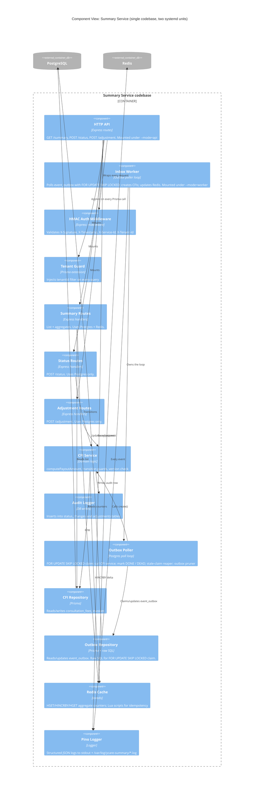

# C4 — Component View (inside the Summary Service)

The two Summary Service processes (API and worker) share a `shared/` library. The component view below shows the modules within a single Express codebase.



## Module map (file layout)

```
src/
  api/                          ← HTTP layer (--mode=api)
    index.ts                    ← Express app bootstrap
    middleware/
      hmac-auth.ts
      request-id.ts
      pino-http.ts
    routes/
      summary.ts
      status.ts
      adjustment.ts
      health.ts                 ← GET /healthz (no auth)
  worker/                       ← inbox worker (--mode=worker)
    index.ts                    ← bootstrap + main loop
    outbox-poller.ts            ← FOR UPDATE SKIP LOCKED claim + status update
    reaper.ts                   ← periodic stale-claim reset
    pruner.ts                   ← periodic deletion of old DONE rows
  shared/                       ← imported by both modes
    db/
      prisma.ts                 ← Prisma client singleton
      tenant-extension.ts       ← Prisma extension injecting tenantId
    redis/
      client.ts                 ← ioredis singleton
      lua/                      ← atomic Lua scripts
        apply-event.lua
    domain/
      cfi.ts                    ← CFI types, status enum, transition table
      payout.ts                 ← computePayoutAmount(amount, adjustment)
      filters.ts                ← Zod schemas for filter inputs
    audit/
      status-logger.ts
      adjustment-logger.ts
  lib/
    logger.ts                   ← pino instance with required fields
    config.ts                   ← env-var parsing
    errors.ts                   ← AppError, TransitionError, AdjustmentLockedError
  index.ts                      ← entry: parse args, branch on --mode
```

## Mode switching

`src/index.ts` is the single binary entry point:

```ts
const mode = process.argv.includes('--mode=api') ? 'api'
           : process.argv.includes('--mode=worker') ? 'worker'
           : (() => { throw new Error('Missing --mode') })();

if (mode === 'api') {
  await import('./api/index.ts');
} else {
  await import('./worker/index.ts');
}
```

The two systemd units differ only in their `ExecStart` flag.
