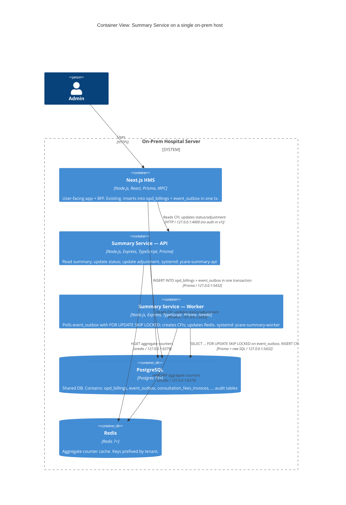

# C4 — Container View

The container view shows the deployable units: the two Summary Service processes (API and worker), the existing HMS Next.js process, Postgres, and Redis.

## Container responsibilities

| Container | Role | Port | Restart policy |
|---|---|---|---|
| **Next.js HMS** | User-facing app + BFF | 3000 | (existing) |
| **Summary Service — API** | HTTP API for reads + status/adjustment writes | 4000 (127.0.0.1 only) | `Restart=on-failure`, 5s delay |
| **Summary Service — Worker** | Outbox poller, CFI creator, Redis updater | n/a (no HTTP) | `Restart=on-failure`, 5s delay |
| **PostgreSQL** | Shared DB | 5432 | (existing) |
| **Redis** | Aggregate cache | 6379 (127.0.0.1 only) | (existing post-install) |

## Inter-container communication

- **Next.js → Postgres:** HMS writes `opd_billings` and `event_outbox` in a single transaction. This is the only way the HMS talks to the Summary Service's data layer (ADR 0001).
- **Next.js → Summary API:** HTTP. v1 has no auth; the BFF and the API trust the localhost bind. (v2 will add a real service-to-service auth.)
- **Worker → Postgres:** `SELECT ... FOR UPDATE SKIP LOCKED` on `event_outbox` to claim a batch; `INSERT` to create a CFI; periodic reaper to reset stuck claims; periodic pruner to delete old `DONE` rows.
- **API / Worker → Redis:** ioredis. Localhost only. Read-side cache only; Redis is never on the publish path.

## Why a single host?

The on-prem install is a single server in the hospital. The HMS already runs there. The Summary Service shares the host. This is intentional — operational simplicity wins over modest performance gains from separation. If the host becomes a bottleneck (see `ops/capacity-plan.md`), a second host can be added with Postgres replication.
