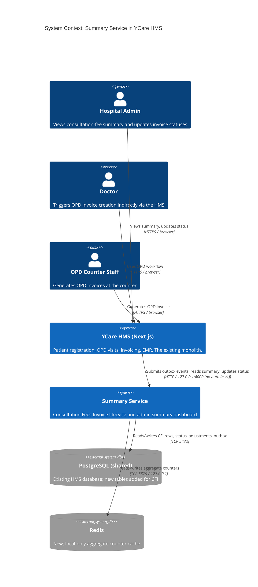

# C4 — System Context

The Summary Service in the YCare HMS landscape.

## Key relationships

- **Admin** interacts only with the HMS; the HMS proxies to the Summary Service. The admin never talks to the Summary Service directly.
- **OPD staff** generates OPD invoices in the HMS. The Summary Service does not see the staff directly — it only sees the resulting outbox events in the DB.
- The **HMS → Summary Service** link is the only call surface. It is local (127.0.0.1:4000). v1 has no service-to-service auth; trust relies on the localhost bind. Auth is a v2 follow-up.
- **PostgreSQL** is shared between HMS and Summary Service. Both write to the same DB, in different tables.
- **Redis** is new, local-only, used only by the Summary Service.

## What's NOT in the picture

- No internet. The hospital server is on a private network.
- No external service dependencies. No cloud, no SaaS, no notification provider.
- No patient-facing touchpoint. The admin UI is the only UI.
