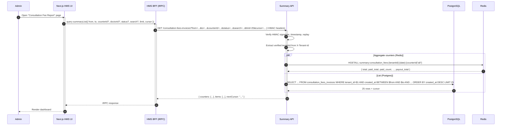

# Sequence Diagrams

Five critical flows for the Summary Service. All use the Postgres outbox trigger mechanism (see ADR 0001).

---

## 1. OPD invoice created → CFI created (happy path)

```mermaid
sequenceDiagram
    autonumber
    participant OpStaff as OPD Staff
    participant HMS as Next.js HMS
    participant PG as PostgreSQL
    participant W as Summary Worker
    participant R as Redis<br/>(aggregate counters)

    OpStaff->>HMS: Submit OPD invoice
    activate HMS
    HMS->>PG: BEGIN; INSERT INTO opd_billings (...); INSERT INTO event_outbox (event_type='opd_invoice.created', aggregate_id=opd_billing.id, payload={eventId, tenantId, opdInvoiceId, createdAt}); COMMIT
    PG-->>HMS: opd_billing_id
    HMS-->>OpStaff: 201 Created (opd_invoice_id)
    deactivate HMS

    Note over W,PG: Worker is in a poll loop:<br/>SELECT ... FROM event_outbox WHERE status='PENDING' AND next_attempt_at <= now() ORDER BY next_attempt_at LIMIT 10 FOR UPDATE SKIP LOCKED
    W->>PG: Claim batch (raw SQL, transactional)
    PG-->>W: 1 row claimed; status -> IN_PROGRESS, locked_by=worker-host-1
    activate W

    W->>PG: SELECT id, amount FROM opd_billing_services obs JOIN services s ON s.id=obs.service_id WHERE obs.opd_billing_id=$1 AND obs.is_cancel=false AND s.is_consultation_service=true
    PG-->>W: [{amount: 5000}, ...]  (sum = 5000)
    W->>W: computePayoutAmount(5000, 0) = 5000

    W->>PG: BEGIN; INSERT INTO consultation_fees_invoices (event_id, tenant_id, opd_invoice_id, ..., amount=5000, adjustment=0, payout_amount=5000, status='UNPAID', version=1) ON CONFLICT (event_id) DO NOTHING; COMMIT
    PG-->>W: inserted (1 row)
    W->>R: EVAL "apply event" (HINCRBY summary:consultation_fees:{tenantId}:{date}:{counter|"all"} total=... unpaid_count=+1 unpaid_total=+amount payout_total=+amount)
    R-->>W: OK
    W->>PG: UPDATE event_outbox SET status='DONE', completed_at=now() WHERE id=$1
    deactivate W
```

**Notes:**
- The HMS and Postgres are the only actors in the publish path. Redis is **not** on the publish path (the HMS does not touch Redis at all in this design).
- The outbox row is committed in the same transaction as the OPD billing. There is no window where the OPD billing exists without a corresponding outbox row.
- The worker's claim is transactional: claim a batch, then process each event in its own transaction. A crash mid-batch leaves the IN_PROGRESS rows to be reset by the reaper.
- The `ON CONFLICT (event_id) DO NOTHING` is the idempotency guard (see ADR 0003). If the reaper reset the row and the worker re-processes it, the insert is a no-op.
- The Redis Lua script `apply event` is atomic and idempotent.
- End-to-end latency from `opd_billings` commit to `consultation_fees_invoices` insert: typically 1-2s (limited by the poll interval).

---

## 2. Worker crash mid-event → reaper resets → re-processed safely

```mermaid
sequenceDiagram
    autonumber
    participant HMS as Next.js HMS
    participant PG as PostgreSQL
    participant W as Summary Worker
    participant R as Redis

    HMS->>PG: BEGIN; INSERT INTO opd_billings + INSERT INTO event_outbox; COMMIT
    PG-->>HMS: ok

    Note over W,PG: Worker poll loop claims the row
    W->>PG: SELECT ... FOR UPDATE SKIP LOCKED
    PG-->>W: 1 row (event A)
    W->>PG: UPDATE event_outbox SET status='IN_PROGRESS', locked_by='worker-1', locked_at=now() WHERE id=$1
    Note over W: Worker is processing event A...
    W->>PG: INSERT INTO consultation_fees_invoices (event_id, ...)
    PG-->>W: ok
    W--xR: Redis call — worker process crashes here
    Note over W,R: Worker dies. Outbox row stays IN_PROGRESS.<br/>Redis never received the HINCRBY.<br/>CFI row was inserted in its own transaction.

    Note over W: ... time passes ...<br/>(> 5 minutes)
    W->>W: Reaper timer fires
    activate W
    W->>PG: UPDATE event_outbox SET status='PENDING', locked_by=NULL, locked_at=NULL, last_error=coalesce(last_error,'')||' [reaper: stale claim]' WHERE status='IN_PROGRESS' AND locked_at < now() - interval '5 minutes'
    PG-->>W: 1 row reset
    deactivate W

    Note over W,PG: Worker (or another worker) re-claims the row on the next poll
    W->>PG: SELECT ... FOR UPDATE SKIP LOCKED
    PG-->>W: 1 row (event A, attempt_count=2)
    W->>PG: BEGIN; INSERT INTO consultation_fees_invoices (event_id, ...) ON CONFLICT (event_id) DO NOTHING; COMMIT
    PG-->>W: 0 rows (no-op — CFI already exists)
    W->>R: HINCRBY (idempotent via seen_events set in Lua)
    R-->>W: OK
    W->>PG: UPDATE event_outbox SET status='DONE' WHERE id=$1
```

**Notes:**
- The crash is between the CFI insert and the Redis update. The CFI is on disk; the outbox is stuck.
- The reaper resets the row to `PENDING` after 5 minutes of `locked_at` age.
- Re-processing the event is safe because the CFI's `(tenant_id, opd_invoice_id)` UNIQUE constraint plus the `event_id` UNIQUE constraint make the second insert a no-op.
- The Redis Lua script uses a `seen_events` set keyed by `event_id` to skip duplicate `HINCRBY`s.
- Net effect: the CFI shows up within 5 minutes of the worker crash, and the Redis aggregate catches up. No data loss.

---

## 3. Admin loads summary page



**Notes:**
- The list and the counters are fetched in parallel (`par` block). The counters come from Redis (fast path). The list comes from Postgres with proper indexes.
- If Redis is down, the API computes the counters from Postgres (fallback). The response includes a `X-Cache-Status: bypass` header. The CFI list is unaffected because the HMS publish path no longer depends on Redis.
- The search query (if present) is a case-insensitive substring match on `lower(invoice_no)`, accelerated by a `pg_trgm` GIN index (see ADR 0010). Doctor name and patient name are not searched.
- The cursor is the `(created_at, id)` of the last row, opaque to the client.

---

## 4. Admin updates status (PAID or VOID)

```mermaid
sequenceDiagram
    autonumber
    participant Admin
    participant HMS as Next.js HMS UI
    participant BFF as HMS BFF
    participant API as Summary API
    participant PG as PostgreSQL
    participant R as Redis

    Admin->>HMS: Click "Mark as Paid"<br/>(UI has invoice row with version=3)
    activate HMS
    HMS->>BFF: mutation statusUpdate({ id, status: "PAID", reason?: null, version: 3 })
    activate BFF
    BFF->>API: PATCH /consultation-fees-invoices/{id}/status  { status: "PAID" }  If-Match: 3  (+HMAC headers)
    activate API
    API->>API: Verify HMAC
    API->>PG: SELECT id, status, version FROM consultation_fees_invoices WHERE id=$1 AND tenant_id=$2
    PG-->>API: { id, status: "UNPAID", version: 3 }
    API->>API: Check transition: UNPAID → PAID ✓<br/>Check version: 3 === 3 ✓

    API->>PG: BEGIN; UPDATE consultation_fees_invoices SET status='PAID', paid_at=now(), version=4, updated_at=now(), updated_by_id=$userId WHERE id=$1 AND version=3; INSERT INTO consultation_fees_invoice_status_changes (invoice_id, from_status, to_status, changed_by_id, reason) VALUES ($1, 'UNPAID', 'PAID', $userId, null); COMMIT
    PG-->>API: 1 row updated, 1 row inserted

    API->>R: EVAL "apply status change" (HINCRBY old status counters by -amount, -1; HINCRBY new status counters by +amount, +1; HINCRBY payout_total unchanged because amount/adjustment didn't change)
    R-->>R: OK
    API-->>BFF: 200 OK { id, status: "PAID", paidAt: "...", version: 4, ... }
    deactivate API
    BFF-->>HMS: tRPC response
    deactivate BFF
    HMS-->>Admin: Toast "Marked as Paid"; row updates
    deactivate HMS
```

**Notes:**
- The version check (`If-Match`) is mandatory. A mismatch returns `409 VERSION_MISMATCH` with the current version in the body.
- The status transition is validated (UNPAID → PAID is allowed; PAID → anything is rejected with `409 INVALID_TRANSITION`).
- The DB transaction bundles the UPDATE + the audit row insert. If either fails, both roll back.
- The Redis update runs after the DB commit. If Redis fails, the API logs a warning; the next read of that bucket recomputes from Postgres via cache-aside and overwrites.
- The payout_amount does not change on a status change (no adjustment). If the admin had also added an adjustment in the same flow, the API would call the adjustment endpoint after the status change — but per ADR 0014, adjustment is locked once PAID, so this would fail with `409 ADJUSTMENT_LOCKED`.
